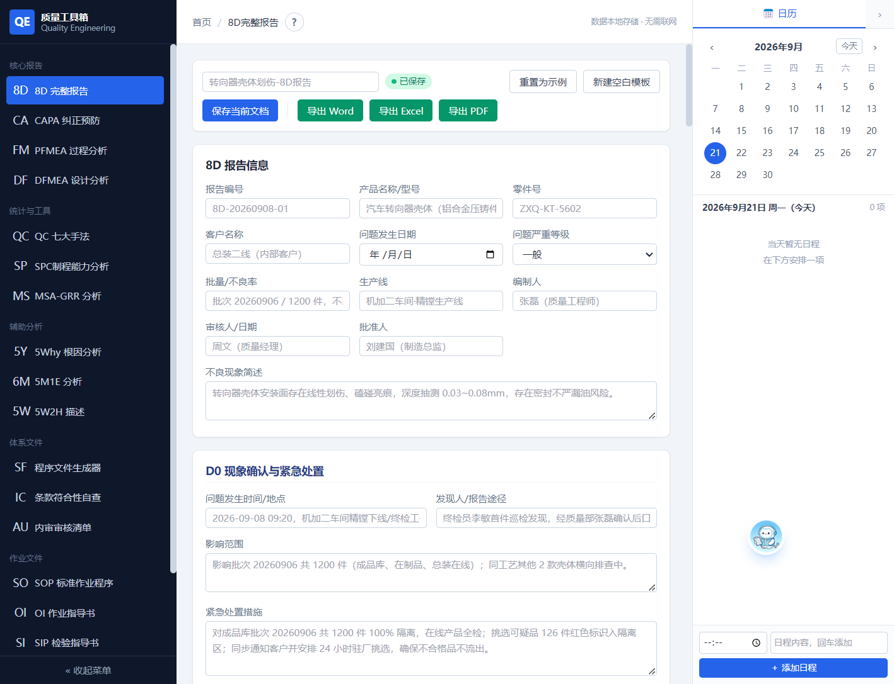
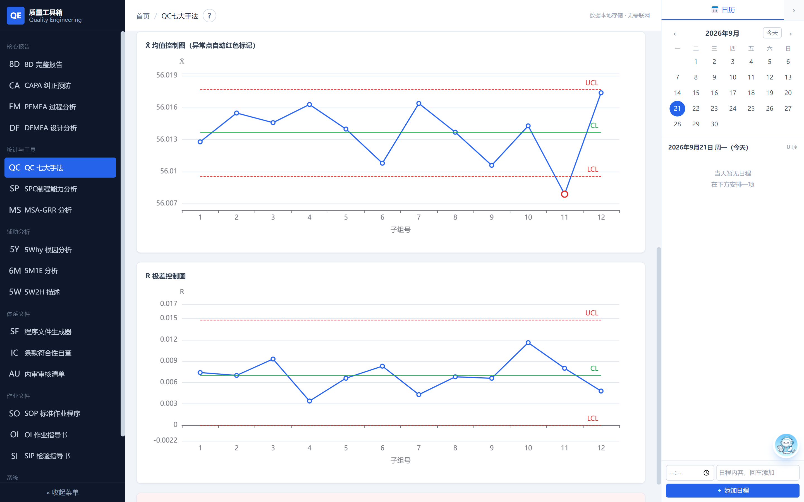
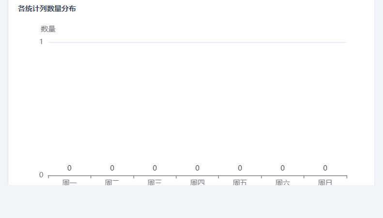

# 🌟 星耀 · 质量工具箱

> 纯本地运行的质量工程师桌面软件 — SPC / MSA / FMEA / 8D / QC 七大手法，内嵌 AI 助手，数据 100% 存本地，无需联网。

---

## ⬇️ 立即下载

| 版本 | 大小 | 说明 |
|------|------|------|
| **[📦 下载安装版](https://gitee.com/xiaotng387724188/xingyao/releases/download/V2.2.5/%E8%B4%A8%E9%87%8F%E5%B7%A5%E5%85%B7%E7%AE%B1%20Setup%202.2.5.exe)** | 65.5 MB | 标准安装程序，含桌面快捷方式与卸载入口 |
| **[🚀 下载便携版](https://gitee.com/xiaotng387724188/xingyao/releases/download/V2.2.5/%E8%B4%A8%E9%87%8F%E5%B7%A5%E5%85%B7%E7%AE%B1-Portable-2.2.5.exe)** | 74.9 MB | 单文件 exe，双击即运行，无需安装 |

> 支持 Windows 10 / 11（64 位）· 当前版本 v2.2.5

---

## ✨ 核心功能

| 功能 | 说明 |
|------|------|
| **📋 8D 完整报告** | D0-D8 全流程，内嵌 5Why 根因分析与鱼骨图，支持图片粘贴，一键导出 Word/Excel/PDF |
| **📊 SPC 制程能力** | 支持 Pm/Pmk、Pp/Ppk、Cp/Cpk 三种研究，X-R 控制图、正态性检验、OCAP 行动计划 |
| **📐 MSA 测量分析** | GRR 重复性与再现性分析，ndc / %PV / 方差分量，自动判定合格与否 |
| **⚠️ PFMEA / DFMEA** | 失效模式与影响分析，S/O/D 评分与 RPN 计算，措施跟踪闭环 |
| **📈 QC 七大手法** | 检查表、柏拉图、直方图、散布图、层别法、X-R 控制图、鱼骨图，列可自定义 |
| **📝 文档生成** | SOP / OI / SIP 作业指导书，支持插图，一键导出 |

---

## 🤖 AI 质量助手

内置 AI 助手，你的质量工程师副驾：

- ✅ **自动填表** — 告诉 AI 要填什么字段，自动写入对应页面
- ✅ **生成测试数据** — 一键生成 125 件符合正态分布的 SPC 测量数据
- ✅ **识别当前页面** — 截图识别图表和表格，给出分析建议
- ✅ **自定义模型** — 支持 Agnes / 智谱 / DeepSeek 等，API Key 自己掌控

---

## 🖼 界面预览

---

## 🆚 安装版 vs 便携版

- **安装版**：通过标准安装程序部署，含桌面快捷方式、开始菜单与卸载入口
- **便携版**：单文件 exe，双击即运行，无需安装，适合 U 盘携带或临时使用

---

## 📧 联系我

- 📮 邮箱：[17783025456@163.com](mailto:17783025456@163.com)
- 💻 软件内【帮助】菜单可提交反馈
- 🔗 [GitHub 仓库](https://github.com/xinxin2344/xingyao) · [Gitee 仓库](https://gitee.com/xiaotng387724188/xingyao)

---

## 🔒 隐私安全

- 数据 100% 存储在本地（`%APPDATA%\qe-toolbox`）
- 不联网、不上传、无广告
- AI 助手 API Key 仅存本地，由用户自行掌控

---

© 2026 星耀质量工具箱 · 数据本地存储 · 无需联网
